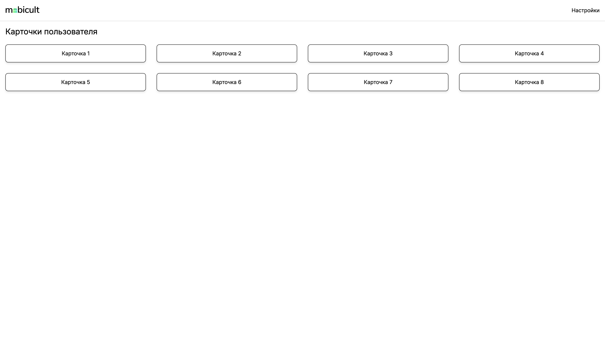
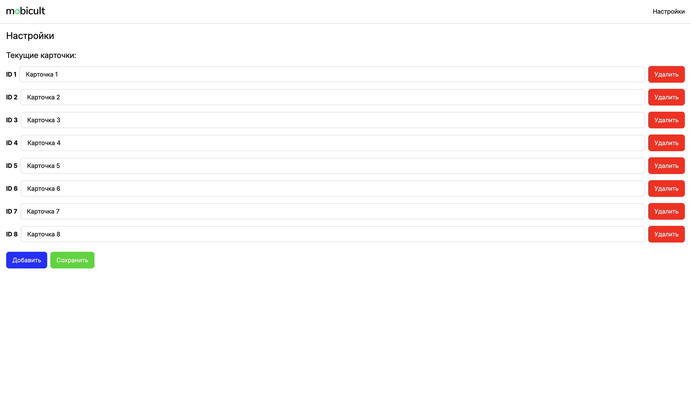
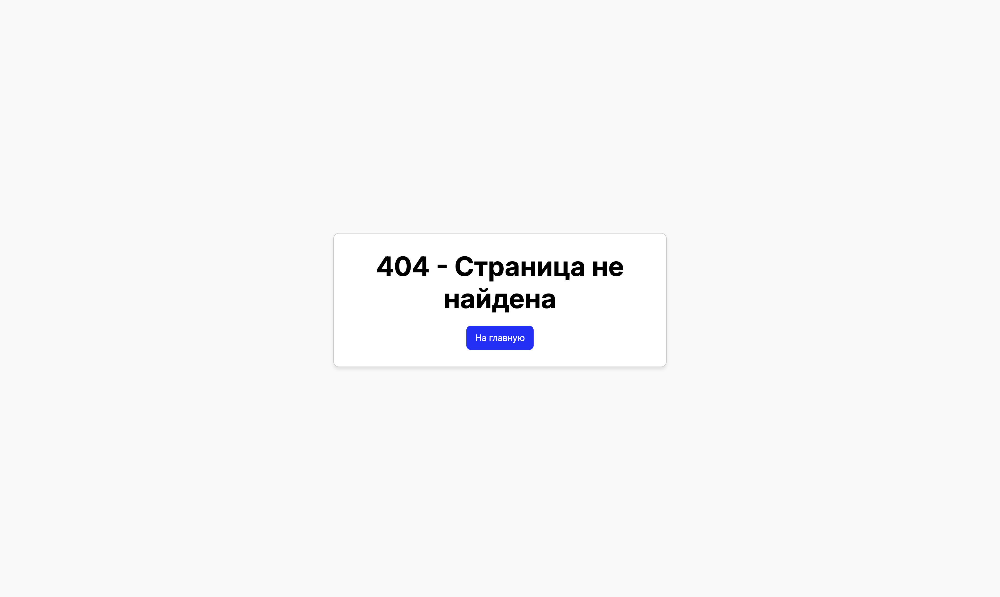

# Настройка проекта

## Установка зависимостей

Для установки зависимости необхнодимо перейти в терминал и ввести:

```bash
# npm
npm install

# pnpm
pnpm install

# yarn
yarn install

# bun
bun install
```

## Dev сервер

Запуск dev-сервера на `http://localhost:3000`:

```bash
# npm
npm run dev

# pnpm
pnpm dev

# yarn
yarn dev

# bun
bun run dev
```

## Docker

Запуск dev-сервера на `http://localhost:3000` с помощью Docker:

```bash
docker compose up
```

## Production

Сборка приложения на прод:

```bash
# npm
npm run build

# pnpm
pnpm build

# yarn
yarn build

# bun
bun run build
```

Локальный просмотр собранного приложения:

```bash
# npm
npm run preview

# pnpm
pnpm preview

# yarn
yarn preview

# bun
bun run preview
```

## Скриншоты приложения

#### Главная страница



#### Страница настроек



#### Странца ошибки


